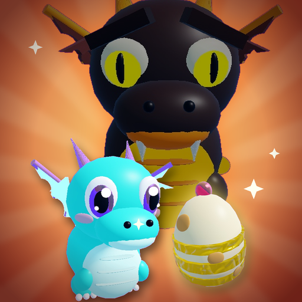
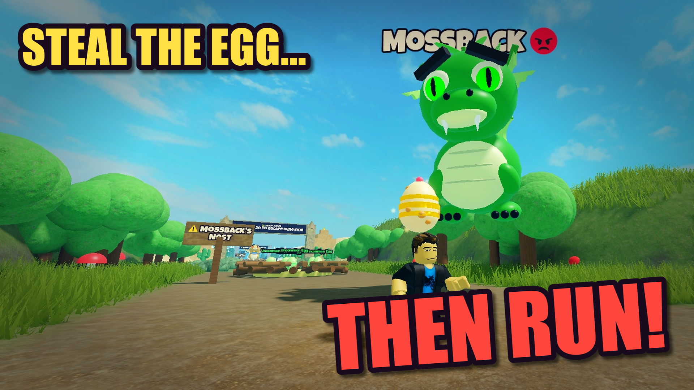
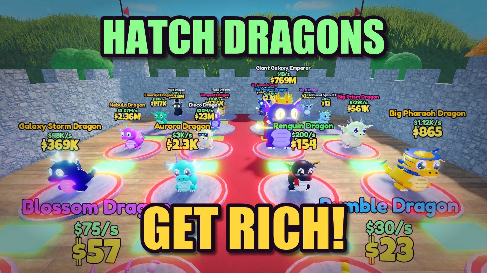
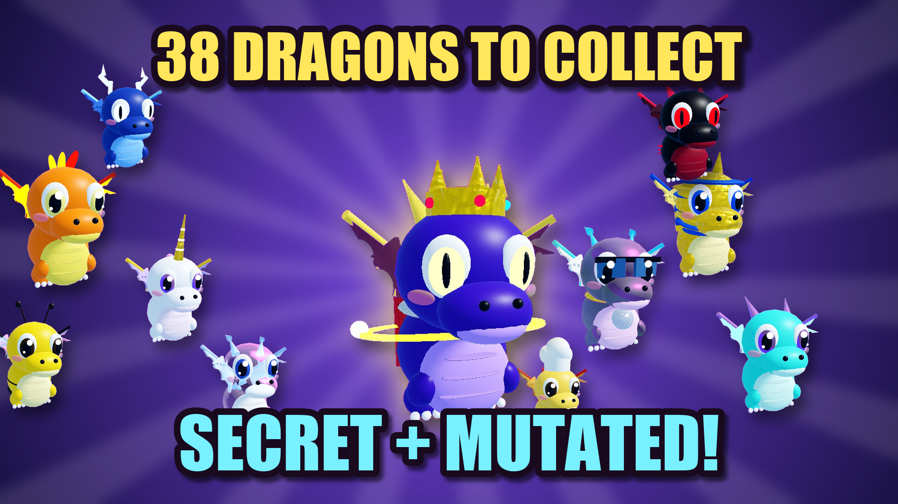

<p align="center">
  
</p>

<h1 align="center">Steal a Dragon Egg 🐉</h1>

<p align="center">
  Grab eggs from giant guardian dragons — then <b>RUN</b>.<br>
  <a href="https://www.roblox.com/games/80066508534970/Steal-a-Dragon-Egg"><b>▶ Play on Roblox</b></a>
</p>

<p align="center">
  
  
  
</p>

---

## The game

A heist-and-collect game in the style of the 2025–26 "Steal a ___" hits, with a twist: you steal from **dragons**, not just from players.

- **Run the Dragon Path.** Eight biomes line a 5,300-stud road: Sunny Meadow, Sandy Dunes, Frostpeak, Magma Mountain, Thunder Cliffs, Crystal Caverns, Shadow Realm and Starfall Summit. Each has a nest of eggs and a sleeping giant guardian.
- **Grab an egg and outrun the guardian.** It wakes, chases you, and gives up at the biome gate. Every guardian is tuned so the biome's recommended speed *just* escapes it (the first biomes are more forgiving).
- **Hatch dragons in your castle.** 38 chibi dragons in seven rarities, five sizes (Tiny to Giant, up to x5) and seven mutations (Golden x2, Diamond x3, Rainbow x5, Lava, Frozen, Blood Moon x6, Galaxy x10). Each dragon earns cash every second, including half-rate offline income for up to 4 hours (8 with VIP). Walk over the green plates to collect.
- **Raid other bases.** Hold E on someone's dragon and carry it home. Owners lock their base (laser door) and **slap** thieves so they drop the loot. New players get 3 minutes of protection, and stolen dragons only change hands when the thief makes it home, so nothing is ever duplicated or lost.
- **Gear:** five slap tiers, Speed Coil, Gravity Coil, Bear Trap, Net Launcher and an Invisibility Cloak (guardians lose track of you).
- **Server events every 7–11 minutes:** Secret Eggs (four secret dragons, up to $80M/s), Meteor Showers (free high-tier eggs crash into the plaza), Golden Hour and the Blood Moon.
- **Retention:** guided tutorial, a free starter egg, daily quests with a bonus, a 7-day login streak, playtime gifts, promo codes, the Dragon Index, global leaderboards, invite rewards and rebirths (+50% income and +2 speed each).
- **Look:** every dragon, egg and guardian is built procedurally from CSG shapes, with idle and flight animations played on the client. Each biome has its own lighting, fog and ambient particles (fireflies, sandstorms, snow, embers, rain with lightning, crystal motes, wisps and shooting stars).

## Monetization

| Type | Items |
|---|---|
| Game passes | 2x Cash (449), VIP (299), Lucky Hatcher (299), Speed Boots (249), Mega Base (249), Auto Collect (199), Super Lock (179), Fast Hatch (149) |
| Cash packs | 29 / 99 / 299 / 999 Robux. Each pays 10 min, 45 min, 3 h or 12 h of your current income, so packs stay worth buying. |
| Boosts | Server Luck for everyone (199), 2x Cash (49), 2x Luck (49), +10 Speed (39), 5-minute lock (39), Hatch Now (19) |
| Server events | Golden Hour (149), Meteor Shower (199), Blood Moon (249), Secret Egg (399) |
| Buy Safely | Skip the chase and buy any nest egg (9–699 by rarity). **The odds panel shows exact dragon, size and mutation chances before any prompt**, and the option is hidden where `PolicyService` restricts paid random items. |
| Private servers | 99 Robux / month |
| Ads | Opt-in rewarded video for a free 10-minute Lucky Hatch |

Receipts are idempotent: every purchase ID is saved before Roblox is told it was granted. IDs live in [`src/ReplicatedStorage/Shared/Products.luau`](src/ReplicatedStorage/Shared/Products.luau). All store icons are rendered from the game's own 3D models (see `tools/photo.mjs`).

## Owner checklist

- [ ] Fill in the **content questionnaire** (Creator Hub → Questionnaire) and make the game **public**.
- [ ] Reach **250 highly engaged 16+ plays** within 60 days so the game opens to all ages (Creator Hub → Audience → Reach). Your account already has ID verification and 2FA.
- [ ] Post short gameplay clips on TikTok, Shorts and Reels: a guardian chase, a Giant or Galaxy hatch, a base raid. Use a trending sound.
- [ ] Optional: a Roblox Ads campaign once the first players are in.
- [ ] Drop new codes in your posts (add them in [`Rewards.luau`](src/ReplicatedStorage/Shared/Rewards.luau)). Current codes: `RELEASE`, `DRAGONS`, `RUNFAST`, `THANKYOU`.

## Admin commands (owner only, and anyone in Studio)

```
/cash 1000000        /speed 20            /egg 3 Legendary 2
/dragon phoenix giant galaxy              /hatchall
/event golden|bloodmoon|meteor|secret     /secret 5
/lock 300            /announce text...
```

## Making changes

- **Add a dragon:** add an entry to [`Species.luau`](src/ReplicatedStorage/Shared/Species.luau). Its `look` table picks colors, horn style, accessories (`extras`) and particles (`fx`). New accessories go in `Extras` in [`DragonBuilder.luau`](src/ReplicatedStorage/Shared/Visuals/DragonBuilder.luau).
- **Balance:** [`Config.luau`](src/ReplicatedStorage/Shared/Config.luau) (speed costs, pads, hatch times, rebirths), [`Biomes.luau`](src/ReplicatedStorage/Shared/Biomes.luau) (speeds, egg odds), [`Traits.luau`](src/ReplicatedStorage/Shared/Traits.luau) (sizes, mutations) and [`Layout.luau`](src/ReplicatedStorage/Shared/Layout.luau) (map and the guardian chase math).
- **World:** `build/world_hub.luau` (lighting, plaza, shops, the eight castle bases), then `build/world_path.luau` (all eight biomes). Run the hub first, because it clears the terrain.

## Project layout

```
src/                          Rojo-style source of truth
  ReplicatedStorage/Shared/   data (species, biomes, traits, config, layout, products), builders, net
  ServerScriptService/        Data, Base, Carry, Nest (eggs + guardian AI), Player, Tool, Shop,
                              Event, Monetization, Rewards, Quest, Leaderboard and Admin services
  StarterPlayer/...           client: base renderer, world FX, tools, HUD, panels, tutorial
build/                        edit-time builders run inside Studio
  shapes.luau                 CSG shapes (ellipsoid, cone, wing, egg, ring)
  world_hub.luau / world_path.luau / lib.luau / photo.luau
tools/                        Node + Python tools that drive Studio over its built-in MCP server
  studio.mjs, sync.mjs, run.mjs, cap.mjs   sync scripts, run Luau, take screenshots
  photo.mjs + key.py          render any dragon or egg on a magenta backdrop and cut it out
  make_icons.py, make_icon.py, make_thumbs.py   store art
marketing/                    icon, thumbnails, product icons, renders
```

### Dev loop

1. Open the place in Roblox Studio with **Assistant → Settings → MCP Servers → Enable Studio as MCP server** on.
2. `node tools/sync.mjs` pushes every script under `src/` into Studio (with syntax checks). `tools/studio-target.txt` holds the place ID, so the right Studio window is used when several are open.
3. If shapes or the world changed, run `node tools/run.mjs build/<file>.luau`.
4. Playtest. In Studio, `ServerStorage.DevHook` lets scripts drive any service, for example `DevHook:Invoke("BaseService", "placeEgg", player, { b = 3, r = "Epic" })`.
5. Publish with **File → Publish to Roblox** (Alt+P).

Save data uses the DataStore `DragonEgg_Live_1`, with session locking, autosave and a final save on shutdown. In Studio without API access the game falls back to temporary data right away.
